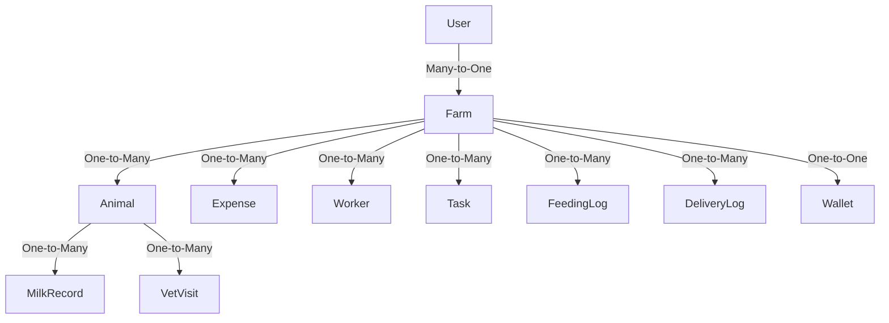

# Database Schema Documentation

## Tables and Columns

### User
- **id**: String (Primary Key)
- **email**: String (Unique)
- **password**: String
- **name**: String
- **role**: Enum (ADMIN, MANAGER, WORKER, VIEWER)
- **farmId**: String (Foreign Key)
- **createdAt**: DateTime
- **updatedAt**: DateTime

### Farm
- **id**: String (Primary Key)
- **name**: String
- **location**: String
- **totalArea**: Float
- **ownerName**: String
- **contactNumber**: String
- **developmentStatus**: Enum (PLANNING, LAND_ACQUISITION, INFRASTRUCTURE, etc.)
- **estimatedCompletionDate**: DateTime
- **createdAt**: DateTime
- **updatedAt**: DateTime

### Animal
- **id**: String (Primary Key)
- **tagNumber**: String (Unique)
- **name**: String
- **breed**: String
- **dateOfBirth**: DateTime
- **gender**: Enum (MALE, FEMALE)
- **type**: Enum (COW, BUFFALO)
- **lifeStage**: Enum (CALF, HEIFER, ADULT)
- **status**: Enum (ACTIVE, PREGNANT, SICK, etc.)
- **farmId**: String (Foreign Key)
- **createdAt**: DateTime
- **updatedAt**: DateTime

### MilkRecord
- **id**: String (Primary Key)
- **animalId**: String (Foreign Key)
- **farmId**: String (Foreign Key)
- **date**: DateTime
- **session**: Enum (MORNING, EVENING)
- **quantity**: Float
- **fatContent**: Float
- **quality**: Enum (EXCELLENT, GOOD, AVERAGE, POOR)
- **createdAt**: DateTime
- **updatedAt**: DateTime

### Expense
- **id**: String (Primary Key)
- **farmId**: String (Foreign Key)
- **category**: Enum (FEED, MEDICINE, EQUIPMENT, etc.)
- **amount**: Float
- **date**: DateTime
- **createdById**: String (Foreign Key)
- **createdAt**: DateTime
- **updatedAt**: DateTime

### Worker
- **id**: String (Primary Key)
- **farmId**: String (Foreign Key)
- **name**: String
- **role**: Enum (MANAGER, SUPERVISOR, MILKER, etc.)
- **shift**: Enum (MORNING, EVENING, NIGHT, etc.)
- **salary**: Float
- **joinDate**: DateTime
- **status**: Enum (ACTIVE, ON_LEAVE, etc.)
- **createdAt**: DateTime
- **updatedAt**: DateTime

### Task
- **id**: String (Primary Key)
- **farmId**: String (Foreign Key)
- **title**: String
- **description**: String
- **assignedToId**: String (Foreign Key)
- **dueDate**: DateTime
- **priority**: Enum (LOW, MEDIUM, HIGH, URGENT)
- **status**: Enum (PENDING, IN_PROGRESS, COMPLETED, CANCELLED)
- **createdById**: String (Foreign Key)
- **createdAt**: DateTime
- **updatedAt**: DateTime

### FeedingLog
- **id**: String (Primary Key)
- **farmId**: String (Foreign Key)
- **animalId**: String (Foreign Key)
- **date**: DateTime
- **feedingTime**: Enum (MORNING, AFTERNOON, EVENING)
- **feedType**: Enum (HAY, SILAGE, CONCENTRATE, etc.)
- **quantity**: Float
- **cost**: Float
- **recordedById**: String (Foreign Key)
- **createdAt**: DateTime
- **updatedAt**: DateTime

### DeliveryLog
- **id**: String (Primary Key)
- **farmId**: String (Foreign Key)
- **deliveryDate**: DateTime
- **buyerName**: String
- **quantity**: Float
- **pricePerLiter**: Float
- **totalAmount**: Float
- **deliveryStatus**: Enum (PENDING, DELIVERED, CANCELLED)
- **paymentStatus**: Enum (PENDING, PAID, PARTIAL, OVERDUE)
- **createdById**: String (Foreign Key)
- **createdAt**: DateTime
- **updatedAt**: DateTime

### VetVisit
- **id**: String (Primary Key)
- **animalId**: String (Foreign Key)
- **visitDate**: DateTime
- **visitType**: Enum (ROUTINE, EMERGENCY, etc.)
- **visitReason**: String
- **treatmentType**: Enum (VACCINATION, MEDICATION, etc.)
- **veterinarian**: String
- **cost**: Float
- **visitStatus**: Enum (SCHEDULED, COMPLETED, CANCELLED)
- **createdAt**: DateTime
- **updatedAt**: DateTime

### Wallet
- **id**: String (Primary Key)
- **farmId**: String (Foreign Key)
- **currentBalance**: Float
- **lastUpdated**: DateTime
- **createdAt**: DateTime
- **updatedAt**: DateTime

## Relationships

- **User** ↔ **Farm**: Many-to-One
- **Farm** ↔ **Animal**: One-to-Many
- **Animal** ↔ **MilkRecord**: One-to-Many
- **Farm** ↔ **Expense**: One-to-Many
- **Farm** ↔ **Worker**: One-to-Many
- **Farm** ↔ **Task**: One-to-Many
- **Farm** ↔ **FeedingLog**: One-to-Many
- **Farm** ↔ **DeliveryLog**: One-to-Many
- **Animal** ↔ **VetVisit**: One-to-Many
- **Farm** ↔ **Wallet**: One-to-One

## Visual Representation

